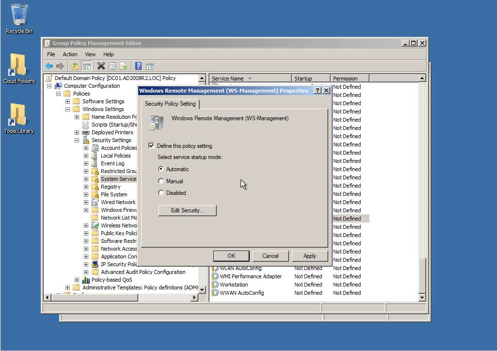
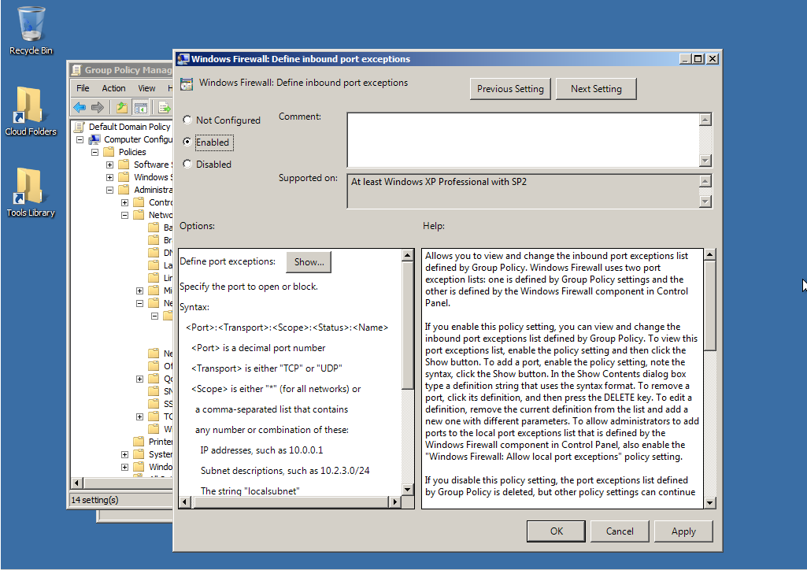

# Configuring Remoting via GPO

PowerShell's about\_remote\_troubleshooting provides a good set of steps for configuring basic Remoting functionality via Group Policy objects (GPOs). Running Enable-PSRemoting also reveals some useful details, such as the four main configuration. In this section, we'll cover these main configuration steps.

**Note:** None of this is necessary on Windows Server 2012 and later versions of the server OS. Remoting is enabled by default on those, and shouldn't be turned off, as many of the native management tools (including GUI consoles like Server Manager) depend upon Remoting.

## GPO Caveats

One thing to keep in mind is that GPOs can only create configuration changes; they can't necessarily change the active state of the computer. In other words, while a GPO can configure a service's start mode to "Automatic," it can't start the service. That'll happen automatically when the computer is restarted. It isn't so much that a restart is needed, just that the computer only starts services after booting. So in many cases, the changes you make with a GPO (with regard to Remoting) won't actually take effect until the next time the affected computers are restarted, because in most cases the computer only looks at the configuration at boot time. Just be aware of that.

Also, everything in this section assumes that PowerShell is already installed on the target computers - something that can also be accomplished with a GPO or other software deployment mechanism, but not something we're going to cover here. Note that most of this section should apply to either PowerShell v2 or v3; we're going to run through the examples using v2 on a Windows 7 client computer belonging to a Windows Server 2008 R2 domain.

**Note:** Some of the GPO settings we'll be reviewing became available in Windows 2008 and Windows 2008 R2, but you should be able to install the necessary administrative templates into any domain controller. The Windows 7 (and later versions) Remote Server Administration Toolkit (RSAT) contains the necessary templates.

We don't know for sure that the GPO configuration steps need to be accomplished in the order we present them; in most cases, we expect you'll do them all at once in a single GPO, so it won't matter. We're taking them step-by-step in this order so that we can check the individual results along the way.

## Allowing Automatic Configuration of WinRM Listeners

As explained earlier in this guide, the WinRM service sets up one or more listeners to accept incoming traffic. Running Enable-PSRemoting, for example, sets up an HTTP listener, and we've covered how to set up an HTTPS listener in addition to, or instead of, that default one.

You'll find this setting under: Computer Configuration\Administrative Templates\Windows Components\Windows Remote Management (WinRM)\WinRM Service. Enable the policy, and specify the IPv4 and IPv6 filters, which determine which IP addresses listeners will be configured on. You can use the \* wildcard to designate all IP addresses, which is what we've done in Figure 7.1.


Figure 7.1: Enabling automatic configuration of WinRM listeners

## Setting the WinRM Service to Start Automatically

This service is set to start automatically on newer server operating systems (Windows Server 2003 and later), but not on clients. So this step will only be required for client computers. Again, this won't start the service, but the next time the computer restarts, the service will start automatically.

Microsoft suggests accomplishing this task by running a PowerShell command - which does not require that Remoting be enabled in order to work:

````
Set-Service WinRM -computername $servers -startup Automatic
````

You can populate $servers any way you like, so long as it contains strings that are computer names, and so long as you have Administrator credentials on those computers. For example, to grab every computer in your domain, you'd run the following (this assumes PowerShell v2 or v3, on a Windows 7 computer with the RSAT installed):
````
Import-Module ActiveDirectory
$servers = Get-ADComputer -filter \* | Select -expand name
````
Practically speaking, you'll probably want to limit the number of computers you do at once by either specifying a -Filter other than "\*" or by specifying -SearchBase and limiting the search to a specific OU. Read the help for Get-ADComputer to learn more about those parameters.

Note that Set-Service will return an error for any computers it couldn't contact, or for which the change didn't work, and then continue on with the next computer.

Alternately, you could configure this with a GPO. Under Computer Configuration\Windows Settings\Security Settings\System Services, look for "Windows Remote Management." Right-click it and set a startup mode of Automatic. That's what we did in figure 7.2.



Figure 7.2: Setting the WinRM service start mode

## Creating a Windows Firewall Exception

This step will be necessary on all computers where the Windows Firewall is enabled. We're assuming that you only want Remoting enabled in your Domain firewall profile, so that's all we're doing in our example. Obviously, you can manage whatever other exceptions you want in whatever profiles are appropriate for your environment.

You'll find one setting under Computer Configuration\Administrative Templates\Network\Network Connections\Windows Firewall\Domain Profile. Note that the "Windows Firewall: Allow Local Port Exceptions" policy simply allows local Administrators to configure Firewall exceptions using the Control Panel; it doesn't actually create any exceptions. That may be exactly what you want in some cases.

Instead, we went to the "Define inbound port exceptions" policy, and Enabled it, as shown in figure 7.3.



Figure 7.3: Enabling Firewall exceptions

We then clicked "Show," and added "5985:TCP:\*:enabled:WinRM" as a new exception, as shown in figure 7.4.


Figure 7.4: Creating the Firewall exception

## Give it a Try!

After applying the above GPO changes, we restarted our client computer. When the WinRM service starts, it checks to see if it has any configured listeners. When it finds that it doesn't, it should try and automatically configure one - which we've now allowed it to do via GPO. The Firewall exception should allow the incoming traffic to reach the listener.

As shown in figure 7.5, it seems to work. We've found the newly created listener!


Figure 7.5: Checking the newly created WinRM listener

Of course, the proof - as they say - is in the pudding. So we ran to another computer and, as shown in figure 7.6, were able to initiate an interactive Remoting session to our original client computer. We didn't configure anything except via GPO, and it's all working.


Figure 7-6: Initiating a 1-to-1 Remoting session with the GPO-configured client computer

## What You Cant Do with a GPO

You can't use a GPO to start the WinRM service, as we've already stated. You also can't create custom listeners via GPO, nor can you create custom PowerShell endpoints (session configurations). However, once basic Remoting is enabled via GPO, you can use PowerShell's Invoke-Command cmdlet to remotely perform those other tasks. You could even use Invoke-Command to remotely disable the default HTTP listener, if that's what you wanted.

Also keep in mind that PowerShell's WSMAN PSProvider can map remote computers' WinRM configuration into your local WSMAN: drive. That's why, by default, the top-level "folder" in that drive is "localhost;" so that there's a spot to add other computers, if desired. That offers another way to configure listeners and other Remoting-related settings.

The real key is to use GPO to get Remoting up and running in this basic form, which is what we've shown you how to do. From there, you can use Remoting itself to tweak, reconfigure, and modify the configuration.

